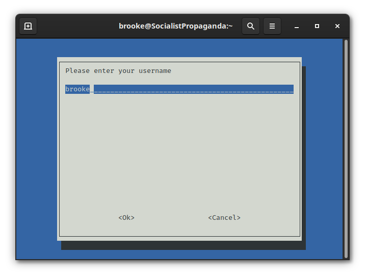
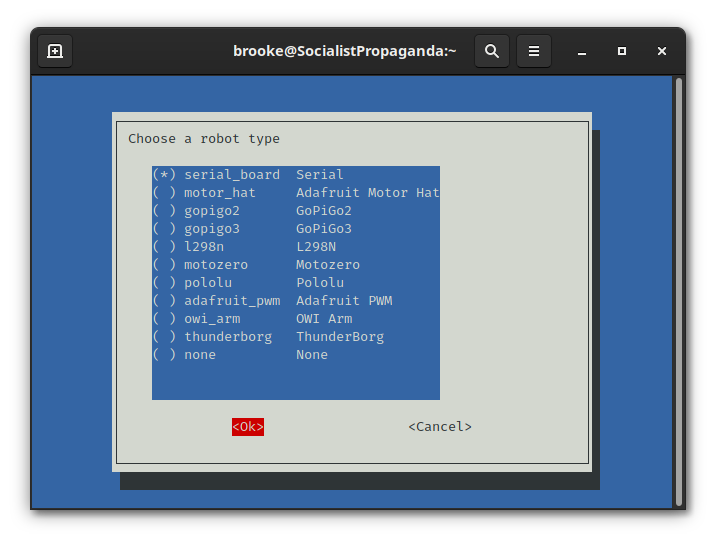
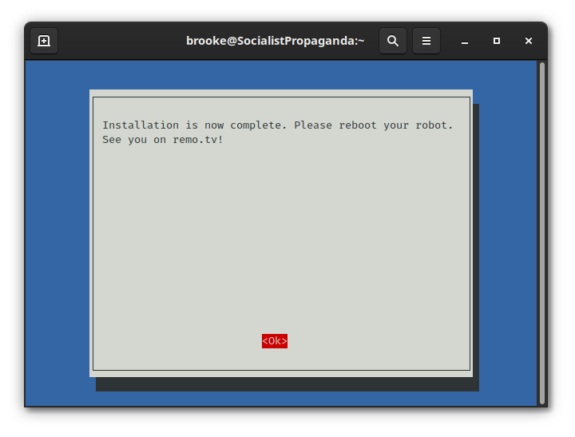

===================
Guided Installation
===================

We made an installer to get you up and running as quickly as we can! After you 
make a robot on the site, all you need to do is follow the on-screen prompts.

#. Copy and paste this command into a terminal. This is best handled via SSH. ::

    wget -O - https://raw.githubusercontent.com/remotv/controller/master/scripts/install.sh | bash -

#. If you are ready to install, press ``enter`` on your keyboard.

.. image:: ./img/guided_install_1.png

#. Enter the username you signed up for remo.tv with.

#. Enter your robot's API key. You can get this by clicking on your robot in the 
   channels list.

.. image:: ./img/guided_install_3.png 

#. Select your robot type.

    .. attention:: You need to select your choice with ``space`` before pressing
        ``enter``.

#. Installation is now complete. It's safe to reboot your robot; or you can run
   it manually by running ::

    cd ~/remotv && python controller.py 

