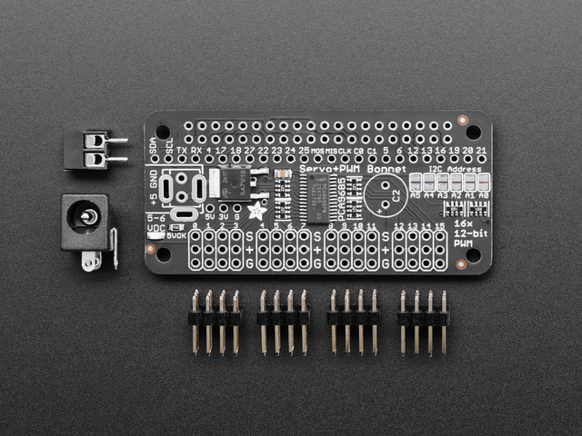

======================
Adafruit PWM Servo Hat
======================

The Raspberry Pi is a wonderful little computer, but one thing it isn't very
good at is controlling DC servo motors - these motors need very specific and 
repetitive timing pulses to set the position. Instead of asking the Pi Linux
kernel to send these signals, pop on Adafruit's handy HAT or Bonnet.

These boards add the capability to control 16 servos with perfect timing. They 
can also do PWM up to 1.6 KHz with 12 bit precision, all completely free running.

Works with any servo that can be powered by 5V and take 3.3V logic level signals.

The Adafruit 16-Channel 12-Bit PWM/Servo HAT or Bonnet (or other PCA9685 based
HAT or Bonnet) will drive up to 16 servos or PWM outputs over I2C with only 2
pins. The on-board PWM controller will drive all 16 channels simultaneously with
no additional Raspberry Pi processing overhead. What's more, you can stack up to
62 of them to control up to 992 servos - all with the same 2 pins!

Library Installation
--------------------
You'll need to install the ``Adafruit_PCA9685`` Python module. This may also 
require enabling I2C. If you are using a Raspberry Pi, you can enable I2C in the
``Interfacing Options`` menu of ``raspi-config``. ::

    sudo raspi-config

Once that's done, from your command line run the following command. ::

    sudo python -m pip install adafruit-pca9685 

Configuration Options
---------------------
+--------------+-------------+-------------------------------------------------+
|Variable      |Default Value|Description                                      |
+==============+=============+=================================================+
|``address``   |``0x40``     |The I2C address of the board.                    |
+--------------+-------------+-------------------------------------------------+
|``pwm_freq``  |``60``       |The frequency at which to pulse width modulate.  |
+--------------+-------------+-------------------------------------------------+
|``more_debug``|``False``    |Enables more verbose debugging when set to       |
|              |             |``True``.                                        |
+--------------+-------------+-------------------------------------------------+