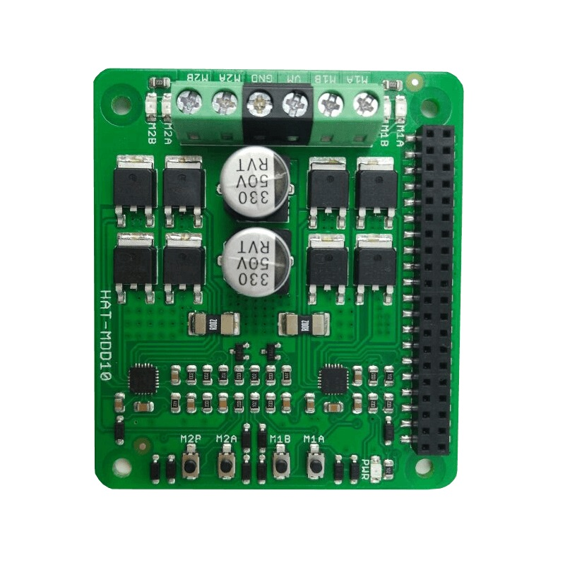

================================
Cytron MDD10 10 Amp Motor Driver
================================

Looking for a high current motor driver for the Raspberry Pi? Here you go, dual
10 Amp continuous motor driver for Raspberry Pi.

Cytron's latest motor driver is designed for the Raspberry Pi, the HAT-MDD10 is 
designed to drive **two** high current brushed DC motors up to 
**10A continuously** using the Raspberry Pi as the controller. It offers 
signed-magnitude PWM control of direction and speed.

Features
========
* Bi-Directional control for 2 brushed DC motors.
* Supported motor voltage ranges from 6-24 VDC.
* Onboard test button for manual control of the motors.
* Every channel output has a built-in LED indicator.
* Maximum current output up to **10A continuous** (without heatsink at 25℃) and
  **30A peak** (10 seconds).
* Current limiting to 30A.
* Raspberry Pi compatible connector.
* All solid state construction.
* Full NMOS H-bridge for better efficiency and no heatsink is required.
* Regenerative braking.
* Speed control PWM frequency up to 20KHz (Actual output frequency is same as 
  input frequency from Raspberry Pi).
* Supports sign-magnitude PWM operation.
* Supports TTL PWM from microcontroller, **NOT PWM from RC Reciver.**

Configuration Options
=====================
+------------------+-------------+---------------------------------------------+
|Variable          |Default Value|Description                                  |
+==================+=============+=============================================+
|``turn_delay``    |``0.4``      |Time in seconds to run the motors while      |
|                  |             |turning. This option is in the ``[robot]``   | 
|                  |             |section.                                     |
+------------------+-------------+---------------------------------------------+
|``straight_delay``|``0.5``      |Time in seconds to run the motors while      |
|                  |             |moving straight. This option is in the       |
|                  |             |``[robot]`` section.                         |
+------------------+-------------+---------------------------------------------+