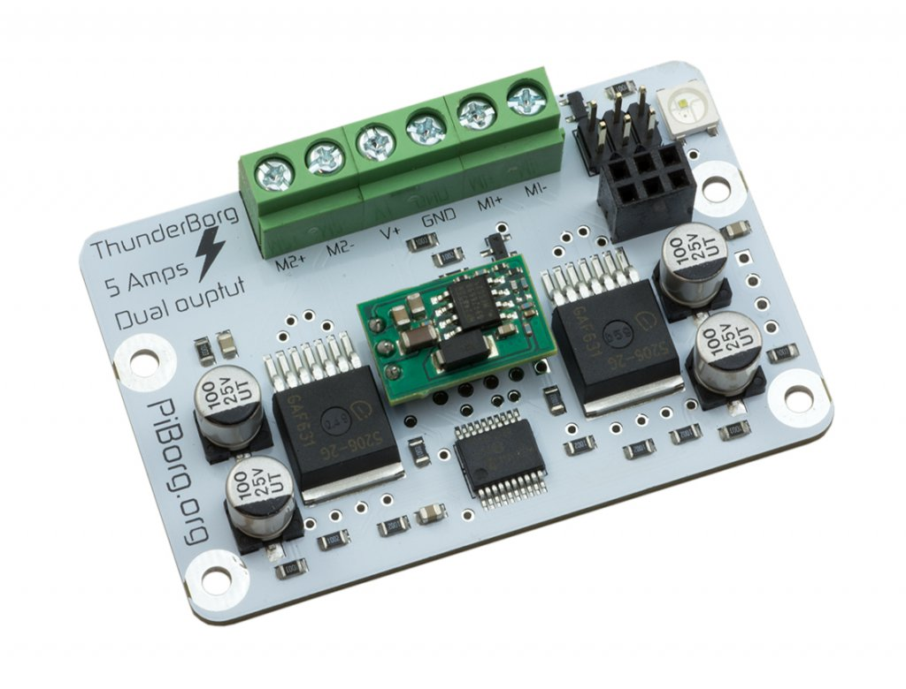

===============================
PiBord ThunderBorg Motor Driver
===============================

ThunderBorg is a powerful dual motor control board for making awesome robots
with your Raspberry Pi. ThunderBorg is designed to handle up to 5 amps per 
motor connection, so it's great for bigger-than-your-average-buggy projects
and making awesome robots from your Raspberry Pi.

All ThunderBorg versions include:

* Control big or small motors
* on-board 5V regulator powers the Raspberry Pi
* Runs from any battery pack or power supply from 7-35V
* Proper 5A per motor connection.
* Speed control forwards and reverse via PWM
* On-board voltage monitoring for attached batteries
* Mounts directly onto most Raspberry Pi models
* Super bright 24-bit LED capable of over 16 million colors
* Stackable! Plug in more boards to control up to 200 motors!
* Uses I2C SCK/SDA and 3.3V/GND pins for communications
* Overheat protection, undervoltage lockout, and short circuit protection

Library Installation
====================

The controller needs a special file to drive the ThunderBorg module. It's not 
the most convenient to download, but it's what we have to work with.

#. Download & extract the example zip file that has the file we need. ::
    
    wget -O ~/examples.zip http://www.piborg.org/downloads/thunderborg/examples.zip
    unzip ~/examples.zip 

#. Copy this single file we need to the ``hardware`` directory. ::

    cp ~/examples/ThunderBorg.py ~/remotv/hardware/ThunderBorgLib.py 

The files you got from the internet can now be deleted if you so choose.

Configuration
=============
There's not really a whole lot to configure. Almost everything is handled for us
by the library. ``Controller.conf`` only has a few settings.

+-------------------+-------------+-----------------------------------------+
|Variable           |Default Value|Description                              |
+===================+=============+=========================================+
|``left_motor_max`` |``1.0``      |Maximum forward speed of the left motor. |
|                   |             |Ranges from ``0.0`` to ``1.0``           |
+-------------------+-------------+-----------------------------------------+
|``right_motor_max``|``1.0``      |Maximum forward speed of the right motor.|
|                   |             |Ranges from ``0.0`` to ``1.0``           |
+-------------------+-------------+-----------------------------------------+
|``sleep_time``     |``0.4``      |Time in milliseconds to move for each    |
|                   |             |command                                  |
+-------------------+-------------+-----------------------------------------+